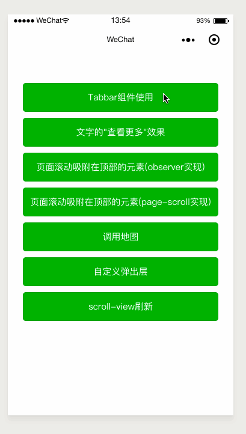

# mini-app-practice
> 微信小程序的踩坑之旅～
### 0.说明：
* 项目演示图



* 项目导入

首先
```
git clone https://github.com/JerryYuanJ/mini-app-pratice.git
```
将项目下载到本地，接着使用微信开发者工具打开该目录即可。
目前实现的功能列表如下：

### 1.自定义组件之导航栏
* 使用方法：
拷贝components/tabbar组件至你的项目中，在页面/父组件中注册该组件即可使用：
```
<tabbar tab-items="{{tabOptions}}" actived-color="green" bind:tab-change="onTabChange">
</tabbar>
```

* 博客：[https://blog.csdn.net/qq_25324335/article/details/83629011](https://blog.csdn.net/qq_25324335/article/details/83629011)

### 2.大段文字的查看更多的效果
* 博客：[https://blog.csdn.net/qq_25324335/article/details/83687550](https://blog.csdn.net/qq_25324335/article/details/83687550)

### 3.元素随着页面的滚动吸附在顶部的实现（使用 IntersectionObserver ）
* 博客：
  * IntersectionObserver 详解：[https://blog.csdn.net/qq_25324335/article/details/83687695](https://blog.csdn.net/qq_25324335/article/details/83687695)
  * 应用实现：[https://blog.csdn.net/qq_25324335/article/details/83688923](https://blog.csdn.net/qq_25324335/article/details/83688923)

### 4.元素随着页面的滚动吸附在顶部的实现（使用页面监听函数 onPageScroll ）
* 博客：[https://blog.csdn.net/qq_25324335/article/details/83688923](https://blog.csdn.net/qq_25324335/article/details/83688923)
  
### 5.调用微信原生地图的简单应用

### 6. 自定义弹出层

### 7.自定义下拉刷新组件
 > **有bug，使用微信的动画API，动画只能执行一次，参考了微信开发者社区的解决方法，即复原动画，也没有用。后续有时间会使用原生js改写动画实现，如果你参考本组件，请不要在生产环境使用（功能不影响，但是会影响用户体验）**
